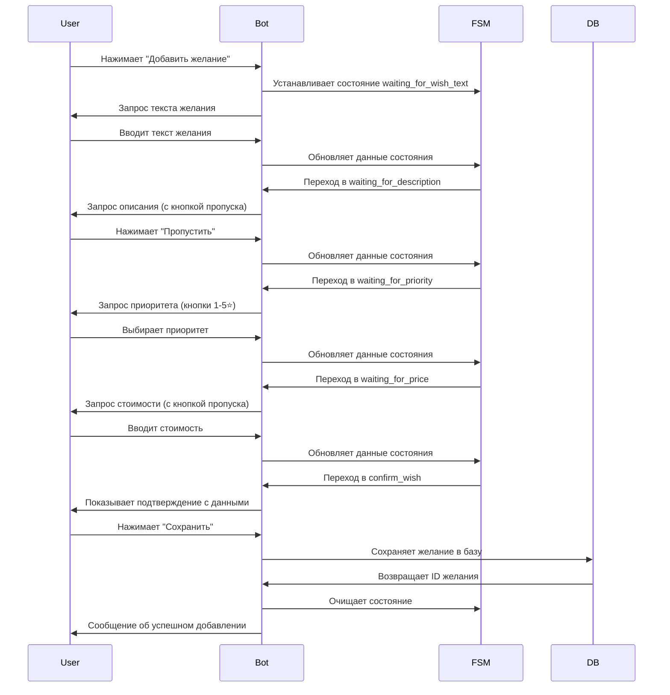
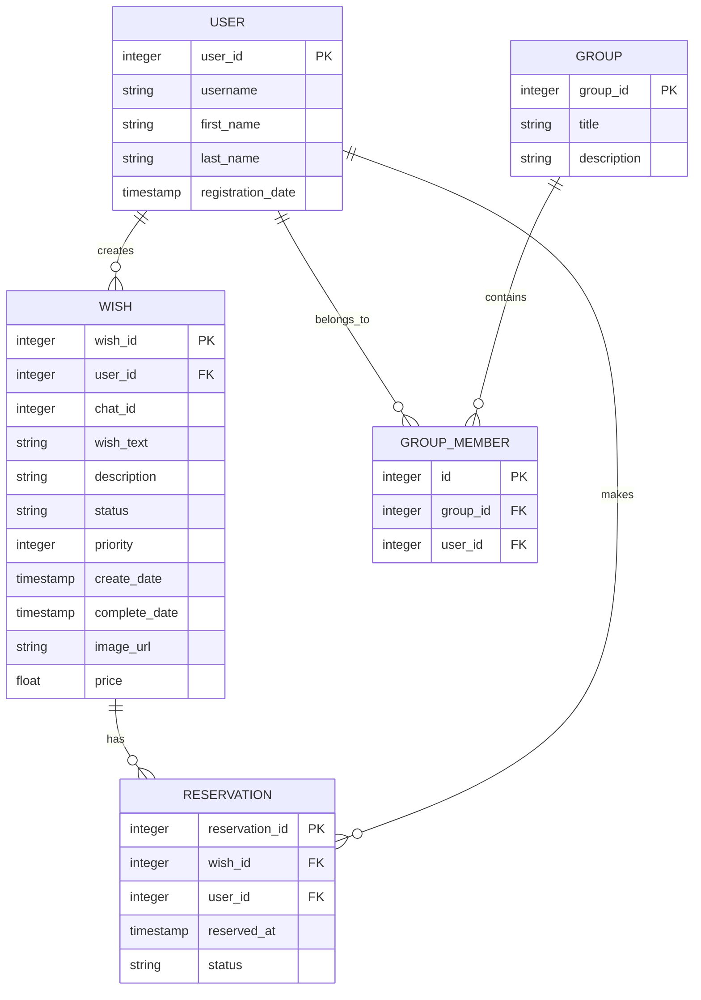

# Описание технологии и реализации Telegram-бота для WishList

## Содержание
1. [Обзор технологии](#обзор-технологии)
2. [Исследование предметной области](#исследование-предметной-области)
3. [Технологический стек](#технологический-стек)
4. [Архитектурные решения](#архитектурные-решения)
5. [Модификации и улучшения](#модификации-и-улучшения)
6. [База данных и модели](#база-данных-и-модели)

## Обзор технологии

### Что такое Telegram Bot API?
Telegram Bot API - это HTTP-интерфейс для создания ботов в Telegram. Он позволяет разработчикам создавать специальные аккаунты (ботов), управляемые программно, которые могут обрабатывать сообщения и команды от пользователей.

### Основные возможности
- Отправка и получение сообщений
- Обработка команд и callback-запросов
- Работа с инлайн-клавиатурами
- Управление состояниями диалогов (FSM)
- Групповые чаты и каналы
- Webhook и Long Polling

## Исследование предметной области

### 1. Анализ существующих решений
- Изучение популярных ботов для управления списками
- Анализ функциональности и UX паттернов
- Выявление потребностей пользователей в управлении желаниями
- Исследование социальных аспектов (совместные списки, резервирование)

### 2. Выбор архитектурного подхода
- Сравнение FSM (Finite State Machine) и линейных диалогов
- Оценка моделей хранения данных (SQLite vs PostgreSQL)
- Анализ паттернов для обработки сложных пользовательских сценариев

### 3. Выбор библиотек и фреймворков
- Сравнение Aiogram 3.x, python-telegram-bot, Telebot
- Оценка поддержки асинхронного программирования
- Анализ возможностей FSM и middleware

## Технологический стек

### Основные компоненты
1. **Python 3.8+**
   - Основной язык разработки
   - Поддержка асинхронного программирования
   - Богатая экосистема библиотек

2. **Aiogram 3.x**
   - Современный асинхронный фреймворк для Telegram Bot API
   - Встроенная поддержка FSM
   - Мощная система middleware и фильтров
   - Активное развитие и сообщество

3. **SQLite**
   - Встроенная реляционная база данных
   - Простота настройки и использования
   - Поддержка транзакций и внешних ключей
   - Идеально для MVP и небольших проектов

4. **python-dotenv**
   - Управление конфигурацией через переменные окружения
   - Безопасное хранение чувствительных данных
   - Упрощение деплоя в разных средах

### Ключевые особенности стека
- **Асинхронность** - эффективная обработка множества запросов
- **Модульность** - четкое разделение ответственности между компонентами
- **Масштабируемость** - возможность легкого перехода на PostgreSQL
- **Поддерживаемость** - чистый код с типами и документацией

## Архитектурные решения

### Паттерны проектирования
1. **Repository Pattern**
   - `db_controller.py` как слой доступа к данным
   - Инкапсуляция логики работы с БД
   - Простота тестирования и модификации

2. **Finite State Machine (FSM)**
   - Управление сложными диалоговыми сценариями
   - Сохранение контекста между сообщениями
   - Четкое разделение этапов взаимодействия

3. **Router Pattern**
   - Модульная организация обработчиков
   - Легкое добавление новых команд
   - Группировка связанного функционала

4. **Callback Query Pattern**
   - Обработка действий из инлайн-клавиатур
   - Динамическое обновление интерфейса
   - Сохранение состояния взаимодействия

### Структура проекта
```
wishlist-bot/
├── bot.py              # Точка входа, инициализация бота
├── config.py           # Конфигурация и переменные окружения
├── db_controller.py    # Слой работы с базой данных
├── handlers.py         # Обработчики сообщений и callback'ов
├── states.py           # Определения состояний FSM
└── .env               # Файл конфигурации
```

### Модульная архитектура

#### 1. Модуль базы данных (`db_controller.py`)
```python
# Организация по функциональным группам
- User функции (управление пользователями)
- Wish функции (CRUD для желаний) 
- Group функции (управление группами)
- Reservation функции (система бронирования)
```

#### 2. Модуль обработчиков (`handlers.py`)
```python
# Группировка по типам взаимодействия
- Command handlers (/start, /wish_list)
- Callback handlers (инлайн-кнопки)
- State handlers (FSM диалоги)
- Message handlers (текстовые сообщения)
```

#### 3. Модуль состояний (`states.py`)
```python
# Логические группы состояний
class AddWishStates(StatesGroup):  # Процесс добавления желания
    waiting_for_wish_text = State()
    waiting_for_description = State()
    # ... остальные состояния

class ViewWishStates(StatesGroup):  # Процесс просмотра желаний
    viewing_wishes = State()
    confirming_delete = State()
    # ... остальные состояния
```

### Диаграмма последовательности добавления желания


## База данных и модели

### ER-диаграмма


### Нормализация данных
1. **Первая нормальная форма (1NF)**
   - Все поля атомарны
   - Отсутствуют повторяющиеся группы

2. **Вторая нормальная форма (2NF)**
   - Все неключевые поля зависят от всего первичного ключа
   - Разделение на логические сущности

3. **Третья нормальная форма (3NF)**
   - Отсутствуют транзитивные зависимости
   - Каждая сущность отвечает за одну концепцию

## Модификации и улучшения

### Реализованные улучшения

#### 1. Улучшенная система диалогов
- **Пошаговый FSM** - четкое разделение этапов ввода данных
- **Валидация на каждом шаге** - предотвращение некорректного ввода
- **Возможность пропуска опциональных полей** - гибкость для пользователя

#### 2. Продвинутые интерфейсы
- **Динамические инлайн-клавиатуры** - контекстно-зависимые кнопки
- **Система пагинации** - удобный просмотр больших списков
- **Подтверждающие диалоги** - предотвращение случайных действий

#### 3. Оптимизация работы с данными
- **Эффективные SQL-запросы** - минимизация времени ответа
- **Транзакционная безопасность** - целостность данных при параллельных операциях
- **Индексация ключевых полей** - быстрый поиск и сортировка

#### 4. Социальные функции
- **Система резервирования** - возможность "забронировать" желания друзей
- **Групповая работа** - совместные списки в чатах
- **Публичные профили** - просмотр wishlist'ов других пользователей

### Технические инновации

#### 1. Асинхронная архитектура
```python
async def add_wish_start(callback: CallbackQuery, state: FSMContext):
    """Асинхронная обработка начала добавления желания"""
    await state.set_state(AddWishStates.waiting_for_wish_text)
    await callback.message.edit_text("✍️ Напишите, что вы хотите добавить...")
```

#### 2. Система обработки ошибок
```python
try:
    wish_id = db_controller.add_wish(...)
    if wish_id:
        await callback.message.edit_text("✅ Желание успешно добавлено!")
    else:
        await callback.message.edit_text("❌ Ошибка при сохранении...")
except Exception as e:
    await callback.message.edit_text(f"❌ Системная ошибка: {str(e)}")
```

#### 3. Гибкая система состояний
```python
class AddWishStates(StatesGroup):
    waiting_for_wish_text = State()    # Ожидание основного текста
    waiting_for_description = State()  # Ожидание описания (опционально)
    waiting_for_priority = State()     # Выбор приоритета
    waiting_for_price = State()        # Ввод стоимости (опционально)
    confirm_wish = State()             # Подтверждение данных
```

### Планируемые улучшения

#### 1. Расширение социальных возможностей
- **Комментарии к желаниям** - обсуждение подарков
- **Система рейтингов** - оценка выполненных желаний
- **Групповые сборы** - совместная покупка дорогих подарков

#### 2. Улучшение пользовательского опыта
- **Умные рекомендации** - AI-предложения на основе истории
- **Напоминания** - уведомления о приближающихся событиях
- **Категоризация** - организация желаний по темам

#### 3. Технические улучшения
- **Миграция на PostgreSQL** - для большей масштабируемости
- **Кэширование Redis** - ускорение частых запросов
- **Система мониторинга** - отслеживание метрик производительности

#### 4. Интеграции
- **API для разработчиков** - возможность создания клиентов
- **Интеграция с маркетплейсами** - автоматический поиск товаров
- **Экспорт данных** - выгрузка списков в различные форматы
